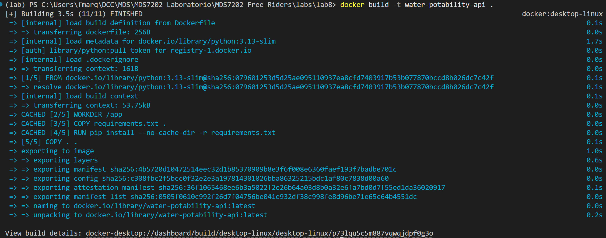
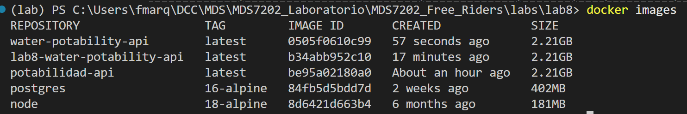
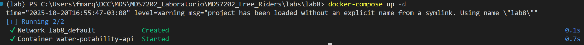
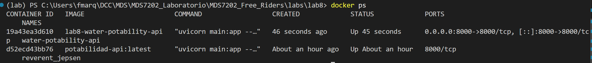
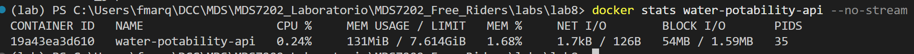
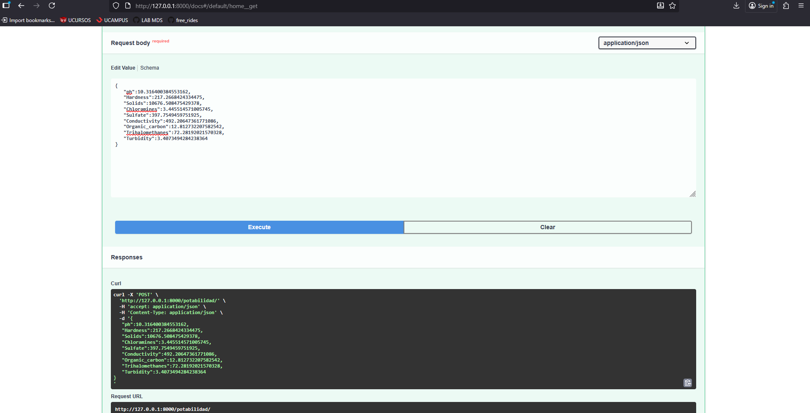
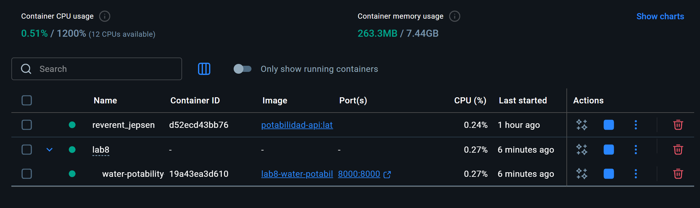

# Laboratorio 8 - Sección 3: Docker

## 3.1 Creación de Container

### Cumplimiento de Requisitos

Hemos implementado la dockerización de la API de potabilidad de agua cumpliendo con todos los requisitos solicitados:

#### 1. Archivo `.dockerignore`

Se ha generado un archivo `.dockerignore` que ignora carpetas y archivos innecesarios.

#### 2. Configuración de Volúmenes

Se ha creado un archivo `docker-compose.yml` que configura volúmenes para la persistencia de datos.

Los volúmenes configurados permiten:
- **`./models:/app/models`**: Persistencia de modelos entrenados
- **`./mlruns:/app/mlruns`**: Persistencia de experimentos y runs de MLflow
- **`./plots:/app/plots`**: Persistencia de gráficos generados

#### 3. Puerto Expuesto

El puerto 8000 está expuesto tanto en el `Dockerfile` como en el `docker-compose.yml`:

- En `Dockerfile`: `EXPOSE 8000`
- En `docker-compose.yml`: Mapeo `"8000:8000"` para acceder a la API desde el host

#### 4. Comandos para Construir y Ejecutar el Contenedor

```bash
# Construir la imagen
docker build -t water-potability-api .

# Ejecutar con docker-compose
docker-compose up -d

# Ver contenedores en ejecución
docker ps

# Ver estadísticas de recursos
docker stats water-potability-api --no-stream

# Ver logs del contenedor
docker logs water-potability-api

# Detener el contenedor
docker-compose down
```

### Evidencias de Ejecución

A continuación se presentan capturas de pantalla que demuestran la construcción y ejecución del contenedor:

**Construcción de la imagen:**



**Imagen creada y su tamaño:**



**Ejecución con docker-compose:**



**Contenedores en ejecución:**



**Estadísticas de recursos del contenedor:**



**Prueba de la API funcionando:**



**Vista desde Docker Desktop:**



---

#### 5. Análisis de Recursos

El contenedor implementado resulta considerablemente liviano comparado con alternativas tradicionales de virtualización. Utilizamos como imagen base Python 3.13-slim, que ocupa aproximadamente 150-200 MB, y con todas las dependencias científicas incluidas como pandas, scikit-learn y xgboost, el tamaño total de la imagen se sitúa entre 500 MB y 1 GB. Durante la ejecución, el contenedor consume entre 200-500 MB de RAM dependiendo del volumen de peticiones que procese, mientras que el uso de CPU es mínimo cuando está en reposo y varía según la carga de predicciones. Una característica notable es su tiempo de inicio casi instantáneo, que oscila entre 2 y 5 segundos.

Cuando comparamos estos números con máquinas virtuales, la diferencia es dramática. Una VM equivalente que ofrezca las mismas funcionalidades requeriría mínimo entre 2-4 GB de RAM solo para arrancar el sistema operativo guest completo, su tiempo de inicio sería de 30-60 segundos, y ocuparía entre 10-20 GB de espacio en disco incluso antes de instalar las dependencias de la aplicación. Esta diferencia radical en el consumo de recursos no es trivial: significa que podríamos ejecutar fácilmente 5-10 instancias de nuestro contenedor en el mismo hardware que apenas soportaría 2-3 máquinas virtuales.

En conclusión, el contenedor Docker demuestra ser extremadamente liviano y eficiente, permitiendonos realizar despliegues rápidos y eficientes.

---

## 3.2 Preguntas de Smapina

### 1. ¿Cómo se diferencia Docker de una máquina virtual (VM)?

La principal diferencia entre Docker y las máquinas virtuales radica en su arquitectura de virtualización. Las máquinas virtuales virtualizan el hardware completo, lo que significa que cada VM incluye un sistema operativo completo (Guest OS) además de la aplicación. Esto consume significativamente más recursos como RAM, CPU y almacenamiento. Las VMs utilizan un hipervisor para gestionar múltiples máquinas virtuales sobre el hardware físico, y típicamente tardan minutos en iniciar y ocupan entre 10-20 GB de espacio en disco.

Por otro lado, Docker virtualiza a nivel del sistema operativo. Los contenedores comparten el kernel del sistema operativo host pero están completamente aislados en espacios de usuario separados. Esto los hace mucho más livianos y rápidos de iniciar, generalmente en cuestión de segundos, y su tamaño varía desde unos pocos megabytes hasta algunos gigabytes. Esta diferencia fundamental hace que Docker tenga un menor consumo de recursos, inicio y detención prácticamente instantáneos, mayor densidad de aplicaciones por servidor, portabilidad superior y un overhead mínimo de rendimiento comparado con las máquinas virtuales tradicionales.

### 2. ¿Cuál es la diferencia entre usar Docker y ejecutar la aplicación directamente en el sistema local?

Cuando ejecutamos una aplicación directamente en el sistema local, las dependencias se instalan globalmente en el sistema operativo, lo que puede generar conflictos potenciales entre versiones de librerías de diferentes proyectos. La configuración queda atada al sistema operativo específico donde se desarrolló, lo que lleva al clásico problema de "funciona en mi máquina" pero falla en otros entornos. Además, es difícil replicar el entorno exacto en otra máquina y el sistema termina contaminado con múltiples dependencias de distintos proyectos.

Con Docker, por el contrario, cada aplicación corre en un entorno completamente aislado con sus dependencias específicas empaquetadas dentro del contenedor. Esto elimina conflictos con otras aplicaciones del sistema y garantiza consistencia entre diferentes máquinas. El despliegue y distribución es mucho más simple, y hacer rollback a versiones anteriores es trivial. El sistema host permanece limpio sin contaminación de dependencias, y el Dockerfile actúa como documentación implícita del entorno, asegurando reproducibilidad perfecta.

Un ejemplo práctico sería tener dos proyectos, uno que requiere Python 3.8 con TensorFlow 2.4 y otro que necesita Python 3.11 con TensorFlow 2.15. Sin Docker tendríamos que gestionar entornos virtuales manualmente y lidiar con posibles conflictos, mientras que con Docker cada proyecto simplemente tiene su propio contenedor completamente aislado sin ninguna interferencia entre ellos.

### 3. ¿Cómo asegura Docker la consistencia entre diferentes entornos de desarrollo y producción?

Docker garantiza consistencia entre diferentes entornos mediante una combinación de mecanismos complementarios. Primero, las imágenes Docker son inmutables, lo que significa que una vez construida, una imagen es idéntica en cualquier lugar donde se ejecute. El hash de la imagen actúa como garantía de que el contenido es exactamente el mismo, sin importar dónde se despliegue.

El uso de Dockerfiles declarativos permite definir exactamente el entorno de forma reproducible, especificando la imagen base, todas las dependencias, configuraciones y comandos necesarios. Este archivo se versiona junto al código fuente, creando un registro histórico de cambios en el entorno. Además, el versionado de imágenes mediante tags (como `myapp:1.0.0` o `myapp:1.0.1`) facilita el control de versiones y permite revertir a versiones anteriores cuando sea necesario.

El aislamiento de dependencias es otro factor crucial. ya que todas las librerías y dependencias están completamente empaquetadas dentro del contenedor, independientes de lo que esté instalado en el sistema host. Las variables de entorno permiten configurar diferencias específicas entre entornos sin modificar el código, usando la misma imagen con configuraciones distintas según si estamos en desarrollo, staging o producción.

Herramientas como Docker Compose, definen servicios, redes y volúmenes de forma reproducible, implementando el concepto de "Infrastructure as Code". Los registros de imágenes, ya sean públicos como Docker Hub o privados, aseguran una distribución centralizada y garantizan que todos los miembros del equipo y todos los entornos usen exactamente la misma versión. El resultado práctico es el principio "Build once, run anywhere": si funciona en desarrollo, funcionará idénticamente en staging y producción, eliminando el clásico problema de "en mi máquina funciona".

### 4. ¿Cómo se gestionan los volúmenes en Docker para la persistencia de datos?

Los volúmenes en Docker resuelven el problema fundamental de la persistencia de datos, considerando que los contenedores son efímeros por naturaleza y cuando se elimina un contenedor, sus datos internos se pierden. Docker ofrece principalmente tres tipos de mecanismos para gestionar volúmenes.

Los volumes son administrados completamente por Docker y representan la mejor opción para la mayoría de casos de persistencia. Se crean con comandos como `docker volume create my_volume` y se montan con `-v my_volume:/app/data`. Docker los ubica generalmente en `/var/lib/docker/volumes/` y gestiona automáticamente los permisos y acceso, además de facilitar operaciones de backup.

Los bind mounts o montajes directos mapean un directorio específico del host al contenedor, como en `./models:/app/models`. Esto es especialmente útil para desarrollo, ya que los cambios en el host se reflejan inmediatamente en el contenedor. Dan control total sobre la ubicación de los datos y son los que utilizamos en nuestro `docker-compose.yml`. Por último, los tmpfs mounts almacenan datos temporales en memoria RAM que no persisten después de detener el contenedor, útiles para datos sensibles o cachés temporales.

Las ventajas de usar volúmenes son múltiples: los datos persisten después de que el contenedor se destruya o actualice, pueden compartirse entre múltiples contenedores, simplifican el backup y migración, ofrecen mejor rendimiento que escribir en la capa de escritura del contenedor, y pueden gestionarse con drivers especializados como NFS o cloud storage.

En nuestro proyecto usamos bind mounts para tres propósitos específicos: `./models:/app/models` persiste los modelos entrenados permitiendo actualizarlos sin reconstruir la imagen, `./mlruns:/app/mlruns` mantiene el historial completo de experimentos MLflow, y `./plots:/app/plots` guarda gráficos generados accesibles directamente desde el host. Esto significa que podemos actualizar un modelo simplemente reemplazando el archivo en `./models/` sin detener el contenedor, o visualizar experimentos MLflow ejecutando `mlflow ui` directamente desde el host.

### 5. ¿Qué son Dockerfile y docker-compose.yml, y cuál es su propósito?

**Dockerfile** es un archivo de texto que contiene una serie de instrucciones para construir una imagen Docker de forma automatizada. Actúa como el "plano de construcción" de la imagen, definiendo la imagen base desde la cual partir, especificando las dependencias a instalar, configurando el entorno de ejecución, determinando qué archivos copiar al contenedor, estableciendo los puertos a exponer y definiendo el comando por defecto a ejecutar.

Por ejemplo, nuestro Dockerfile comienza con `FROM python:3.13-slim` para usar una imagen base ligera de Python, establece el directorio de trabajo con `WORKDIR /app`, copia las dependencias con `COPY requirements.txt .`, las instala con `RUN pip install --no-cache-dir -r requirements.txt`, copia el código con `COPY . .`, documenta el puerto con `EXPOSE 8000`, y finalmente define el comando de inicio con `CMD ["uvicorn", "main:app", "--host", "0.0.0.0", "--port", "8000"]`. Las instrucciones más comunes incluyen `FROM` para la imagen base, `WORKDIR` para el directorio de trabajo, `COPY/ADD` para copiar archivos, `RUN` para ejecutar comandos durante la construcción, `EXPOSE` para documentar puertos, `CMD/ENTRYPOINT` para el comando de inicio, y `ENV` para variables de entorno.

**docker-compose.yml**, por otro lado, es una herramienta para definir y ejecutar aplicaciones Docker multi-contenedor usando un archivo YAML. Su propósito es orquestar múltiples contenedores que trabajan juntos, configurando servicios, redes y volúmenes en un solo archivo. Simplifica enormemente comandos complejos de `docker run`, gestiona dependencias entre servicios, define configuración de entorno de forma declarativa y facilita el desarrollo local de arquitecturas de microservicios.

Nuestro `docker-compose.yml` define el servicio `water-potability-api` que construye desde el Dockerfile local, asigna el nombre del contenedor, mapea el puerto 8000, configura tres volúmenes para persistencia de modelos, experimentos MLflow y gráficos, establece variables de entorno como `PYTHONUNBUFFERED=1`, y define una política de reinicio automático. Las ventajas de usar docker-compose son claras: un solo comando `docker-compose up` reemplaza múltiples comandos `docker run` complejos, la configuración se versiona junto al código, es fácil de entender y mantener, resulta ideal para desarrollo local, y puede extenderse para diferentes entornos como desarrollo, staging y producción.

Las diferencias clave entre ambos son fundamentales para entender sus roles complementarios: mientras que Dockerfile se enfoca en construir una imagen específica usando el comando `docker build` y define "qué es" la aplicación en su esencia, docker-compose.yml se centra en la ejecución y orquestación de uno o más contenedores mediante `docker-compose up`, definiendo "cómo se ejecuta" la aplicación en el ambiente completo. El Dockerfile opera en el ámbito de la construcción produciendo una sola imagen, mientras que docker-compose trabaja en el ámbito de la ejecución coordinando múltiples servicios o contenedores simultáneamente.

Un ejemplo ilustrativo del uso conjunto de ambos archivos sería un escenario con una API, una base de datos PostgreSQL y Redis para caché. El docker-compose.yml definiría el servicio `api` que construye desde el Dockerfile local y expone el puerto 8000, un servicio `db` usando la imagen oficial de postgres:15 con un volumen para persistencia, y un servicio `redis` con la imagen redis:7-alpine. La configuración incluiría las dependencias entre servicios y variables de entorno como las URLs de conexión. Con este setup, un solo comando `docker-compose up` inicia todos los servicios con las configuraciones correctas, mientras que sin docker-compose necesitaríamos ejecutar múltiples comandos `docker run` con opciones complejas para cada servicio.

En conclusión, el Dockerfile garantiza la reproducibilidad de la imagen actuando como la fase de empaquetado, mientras que docker-compose.yml simplifica la configuración compleja de servicios en la fase de despliegue. Ambos son herramientas esenciales y complementarias para un flujo de trabajo Docker profesional y mantenible.
