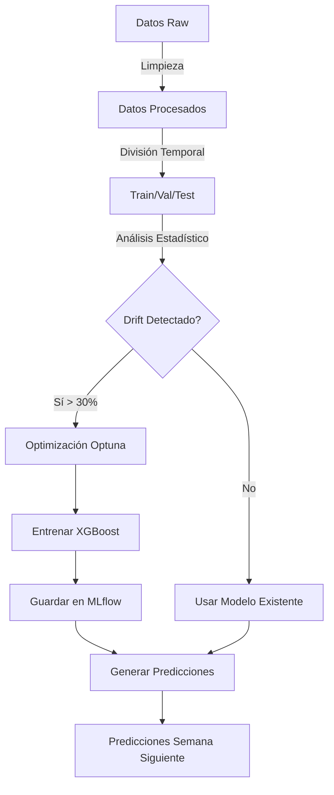

# SodAI Drinks Prediction Pipeline - Documentación Completa

**Equipo:** Free Riders
**Proyecto:** MDS7202 - Laboratorio de Programación Científica para Ciencia de Datos
**Entrega:** 2 - Pipeline Automatizado con Airflow

---

## 📋 Tabla de Contenidos

1. [Descripción General](#-descripción-general)
2. [Arquitectura del Pipeline](#-arquitectura-del-pipeline)
3. [Diagrama de Flujo](#-diagrama-de-flujo)
4. [Descripción de Tareas](#-descripción-de-tareas)
5. [Detección de Drift](#-detección-de-drift)
6. [Lógica de Reentrenamiento](#-lógica-de-reentrenamiento)
7. [Integración con MLflow](#-integración-con-mlflow)
8. [Estructura de Archivos](#-estructura-de-archivos)
9. [Instalación y Configuración](#-instalación-y-configuración)
10. [Ejecución del Pipeline](#-ejecución-del-pipeline)
11. [Generación de Datos de Prueba](#-generación-de-datos-de-prueba)
12. [Resultados y Outputs](#-resultados-y-outputs)
13. [Consideraciones de Producción](#-consideraciones-de-producción)

---

## 🎯 Descripción General

Este proyecto implementa un **pipeline automatizado de Machine Learning** utilizando Apache Airflow para predecir las compras de productos por cliente en la próxima semana. El sistema está diseñado con visión de producción, incluyendo:

- ✅ **Detección automática de drift** en los datos
- ✅ **Reentrenamiento condicional** solo cuando se detecta drift
- ✅ **Optimización de hiperparámetros** con Optuna (50 trials)
- ✅ **Tracking de experimentos** con MLflow
- ✅ **Interpretabilidad** con SHAP values
- ✅ **Predicciones automatizadas** para la próxima semana

### Características Principales

| Característica | Descripción |
|---------------|-------------|
| **Orquestador** | Apache Airflow 3.1.0+ |
| **Modelo** | XGBoost con balanceo de clases |
| **Optimización** | Optuna (50 trials) |
| **Tracking** | MLflow para experimentos y modelos |
| **Interpretabilidad** | SHAP values |
| **Drift Detection** | KS-test (numéricos) + Chi-square (categóricos) |
| **Métrica Principal** | Recall (detectar compras) |

---

## 🏗️ Arquitectura del Pipeline

El pipeline sigue un flujo modular con branching condicional:

```
┌─────────────┐
│    START    │
└──────┬──────┘
       │
       ▼
┌─────────────────┐
│ Extract New Data│
└────────┬────────┘
         │
         ▼
┌─────────────────┐
│ Preprocess Data │
└────────┬────────┘
         │
         ▼
┌─────────────────┐
│   Split Data    │
└────────┬────────┘
         │
         ▼
┌─────────────────┐
│  Detect Drift   │
└────────┬────────┘
         │
         ▼
    ┌────────┐
    │ Branch │
    └───┬─┬──┘
        │ │
    ┌───┘ └────┐
    │          │
    ▼          ▼
┌────────┐  ┌──────────┐
│ Train  │  │   Skip   │
│ Model  │  │ Retrain  │
└───┬────┘  └────┬─────┘
    │            │
    └──────┬─────┘
           │
           ▼
    ┌─────────────┐
    │  Generate   │
    │ Predictions │
    └──────┬──────┘
           │
           ▼
      ┌────────┐
      │  END   │
      └────────┘
```

---

## 📊 Diagrama de Flujo

### Vista del DAG en Airflow UI


*Captura del DAG `sodai_prediction_pipeline` en la interfaz de Airflow*

**Nota:** Para generar esta imagen:
1. Accede a Airflow UI: `http://localhost:8080`
2. Navega al DAG `sodai_prediction_pipeline`
3. Click en la pestaña "Graph"
4. Toma screenshot y guárdalo en `assets/dag_graph_view.png`

### Flujo de Datos



---

## 📝 Descripción de Tareas

### 1. **start** (EmptyOperator)
- **Propósito:** Marca el inicio del pipeline
- **Duración:** Instantáneo
- **Outputs:** Ninguno

### 2. **extract_new_data** (PythonOperator)
- **Función:** `extract_new_data()`
- **Propósito:** Validar que existan datos raw para procesar
- **Validaciones:**
  - Verifica existencia del directorio `data/raw/`
  - Confirma presencia de archivos `.parquet`
  - Lista archivos encontrados
- **En Producción:** Aquí se descargarían datos de APIs, bases de datos, etc.
- **Outputs:** Logs de validación

### 3. **preprocess_data** (PythonOperator)
- **Función:** `run_preprocessing_pipeline()`
- **Módulo:** `load_and_preprocess.py`
- **Propósito:** Limpiar y transformar datos raw
- **Operaciones:**
  1. Carga `clientes.parquet`, `productos.parquet`, `transacciones.parquet`
  2. Limpia transacciones:
     - Elimina duplicados
     - Filtra `items = 0`
     - Convierte items a valores absolutos
  3. Optimiza tipos de datos (int64→int32, float64→float32)
  4. Crea variable temporal `week` (semana del año)
  5. Crea variable objetivo `bought` (1 si hubo compra)
  6. Genera **universo cliente × producto × semana**
  7. Hace merge con datos de clientes y productos
  8. Rellena `bought=0` para pares sin transacción
- **Outputs:** `data/processed/final_data.parquet`
- **Duración Estimada:** 30-60 segundos

### 4. **split_data** (PythonOperator)
- **Función:** `run_data_splitting()`
- **Módulo:** `pipeline.py`
- **Propósito:** Dividir datos respetando temporalidad
- **División:**
  - **Train:** 70% (semanas más antiguas)
  - **Validation:** 15% (semanas intermedias)
  - **Test:** 15% (semanas más recientes)
- **Importante:** División temporal (no aleatoria) para evitar data leakage
- **Outputs:**
  - `data/processed/train_data.parquet`
  - `data/processed/val_data.parquet`
  - `data/processed/test_data.parquet`
- **Duración Estimada:** 10-20 segundos

### 5. **detect_drift** (PythonOperator)
- **Función:** `run_drift_detection()`
- **Módulo:** `drift_detector.py`
- **Propósito:** Detectar cambios estadísticos en distribuciones
- **Features Monitoreados:**
  - **Numéricas:** size, num_deliver_per_week, recency, frequency, customer_product_share, trend
  - **Categóricas:** customer_type, brand, category, sub_category, segment, package
- **Tests Estadísticos:**
  - **KS-test** (Kolmogorov-Smirnov) para variables numéricas
  - **Chi-square** para variables categóricas
- **Threshold:** p-value < 0.05 indica drift en una feature
- **Decisión:** Si >30% de features tienen drift → reentrenar
- **Outputs:**
  - Booleano `needs_retrain` (vía XCom)
  - `drift_reports/drift_report_{execution_date}.json`
- **Duración Estimada:** 20-40 segundos

### 6. **decide_retrain** (BranchPythonOperator)
- **Función:** `decide_retrain()`
- **Propósito:** Branching decision basado en drift
- **Lógica:**
  ```python
  if drift_detected:
      return 'train_model'  # Rama de reentrenamiento
  else:
      return 'skip_retrain'  # Rama de skip
  ```
- **Outputs:** Task ID de siguiente tarea
- **Duración:** Instantáneo

### 7a. **train_model** (PythonOperator) [RAMA CONDICIONAL]
- **Función:** `run_full_training()`
- **Módulo:** `train_module.py`
- **Propósito:** Entrenar modelo completo con optimización
- **Pipeline de Entrenamiento:**

  **Fase 1: Optimización de Hiperparámetros (Optuna)**
  - 50 trials de búsqueda
  - Espacio de búsqueda:
    ```python
    max_depth: [3, 10]
    learning_rate: [0.001, 0.3] (log scale)
    n_estimators: [50, 500]
    min_child_weight: [1, 10]
    gamma: [0, 0.5]
    subsample: [0.6, 1.0]
    colsample_bytree: [0.6, 1.0]
    reg_alpha: [0, 1.0]
    reg_lambda: [0, 1.0]
    ```
  - Métrica de optimización: **Recall** (clase positiva)
  - Tracking de cada trial en MLflow

  **Fase 2: Entrenamiento del Modelo Final**
  - Modelo: XGBoost Classifier
  - Feature Engineering:
    - Clustering geográfico (KMeans, n=2)
    - Features RFM: recency, frequency, customer_product_share, trend
  - Preprocesamiento:
    - Numéricas: Imputation + RobustScaler
    - Categóricas: Imputation + OneHotEncoder
  - Manejo de desbalanceo: `scale_pos_weight` automático

  **Fase 3: Evaluación e Interpretabilidad**
  - Métricas: accuracy, precision, recall, F1, AUC-PR
  - Confusion matrix
  - Precision-Recall curve
  - **SHAP values** (1000 muestras):
    - Summary plot
    - Feature importance plot

  **Fase 4: Persistencia**
  - Guardado en MLflow (modelo + metadata)
  - Guardado local: `models/best_model.pkl`

- **Outputs:**
  - Modelo entrenado en MLflow
  - Archivo `models/best_model.pkl`
  - Gráficos en MLflow
- **Duración Estimada:** 15-30 minutos (depende de Optuna trials)

### 7b. **skip_retrain** (EmptyOperator) [RAMA CONDICIONAL]
- **Propósito:** Placeholder cuando no hay drift
- **Acción:** Ninguna (usa modelo existente)
- **Duración:** Instantáneo

### 8. **generate_predictions** (PythonOperator)
- **Función:** `run_prediction_pipeline()`
- **Módulo:** `predict_module.py`
- **Propósito:** Generar predicciones para próxima semana
- **Trigger Rule:** `NONE_FAILED` (se ejecuta siempre que ambas ramas no fallen)
- **Proceso:**
  1. Carga mejor modelo (MLflow o local)
  2. Identifica última semana en datos: `max(week)`
  3. Crea universo cliente × producto para `week + 1`
  4. Aplica feature engineering
  5. Genera predicciones con probabilidades
  6. Guarda resultados
- **Outputs:**
  - `predictions/predictions_{execution_date}.parquet`
  - Columnas: customer_id, product_id, week, prediction, probability
- **Duración Estimada:** 2-5 minutos

### 9. **end** (EmptyOperator)
- **Propósito:** Marca fin exitoso del pipeline
- **Trigger Rule:** `NONE_FAILED`
- **Duración:** Instantáneo

---

## 🔍 Detección de Drift

### ¿Qué es Drift?

El **drift** es el cambio en las distribuciones de los datos a lo largo del tiempo. Puede ocurrir por:
- Cambios en comportamiento de clientes
- Nuevos productos o categorías
- Estacionalidad
- Eventos externos (promociones, pandemias, etc.)

### Implementación

**Módulo:** `drift_detector.py`

#### Tests Estadísticos

1. **Kolmogorov-Smirnov (KS) Test** para variables numéricas
   - Compara distribuciones de datos históricos vs nuevos
   - Hipótesis nula: ambas muestras vienen de la misma distribución
   - p-value < 0.05 → Rechazamos H₀ → **Drift detectado**

2. **Chi-Square Test** para variables categóricas
   - Compara frecuencias de categorías
   - Hipótesis nula: distribuciones son independientes
   - p-value < 0.05 → Rechazamos H₀ → **Drift detectado**

#### Umbrales

```python
KS_THRESHOLD = 0.05      # p-value para KS test
CHI2_THRESHOLD = 0.05    # p-value para Chi-square test
DRIFT_THRESHOLD = 0.3    # 30% de features con drift → reentrenar
```

#### Decisión de Reentrenamiento

```python
if (features_with_drift / total_features) > 0.3:
    needs_retrain = True  # Reentrenar modelo
else:
    needs_retrain = False  # Usar modelo existente
```

### Reporte de Drift

Cada ejecución genera un reporte JSON:

```json
{
  "timestamp": "2024-11-05T10:30:00",
  "reference_data_shape": [100000, 20],
  "current_data_shape": [15000, 20],
  "total_features_monitored": 12,
  "features_with_drift": 4,
  "drift_ratio": 0.33,
  "drift_threshold": 0.3,
  "needs_retrain": true,
  "feature_statistics": {
    "size": {
      "test": "kolmogorov_smirnov",
      "statistic": 0.045,
      "p_value": 0.023,
      "drift_detected": true
    },
    ...
  }
}
```

---

## 🔄 Lógica de Reentrenamiento

### Flujo Condicional

```
Datos Nuevos
     │
     ▼
Detectar Drift
     │
     ├─→ Drift > 30%? ─→ SÍ ─→ Optimizar Hyperparams ─→ Entrenar ─→ Guardar
     │                                                                   │
     └─→ Drift ≤ 30%? ─→ NO ─→ Usar Modelo Existente ──────────────────┘
                                                                         │
                                                                         ▼
                                                              Generar Predicciones
```

### Ventajas del Enfoque

1. **Eficiencia:** No reentrenamos innecesariamente
2. **Recursos:** Ahorramos tiempo y cómputo
3. **Estabilidad:** Modelo solo cambia cuando es necesario
4. **Trazabilidad:** Cada decisión está documentada en drift reports

### Consideraciones de Producción

En un entorno productivo, además se consideraría:
- **Performance monitoring:** Monitorear métricas del modelo en datos nuevos
- **Drift gradual:** Acumulación de drift leve a lo largo del tiempo
- **Reentrenamiento periódico:** Incluso sin drift, reentrenar cada N semanas
- **A/B testing:** Comparar modelo nuevo vs existente antes de deployment

---

## 🔬 Integración con MLflow

### Configuración

**Tracking URI:** `file:///path/to/mlruns`
**Módulo:** `mlflow_config.py`

### Experimentos Trackeados

1. **Optimización de Hiperparámetros**
   - Experimento: `sodai_drinks_prediction_optimization_{timestamp}`
   - Runs: 1 parent + 50 child runs (uno por trial)
   - Logged:
     - Parámetros de cada trial
     - Métricas: val_recall, val_precision, val_f1, val_auc_pr
     - Gráficos de Optuna (optimization history, param importances)

2. **Modelo Final**
   - Experimento: `sodai_drinks_prediction_final_model_{timestamp}`
   - Logged:
     - Mejores hiperparámetros
     - Métricas de train y validation
     - Classification report
     - Confusion matrix
     - Precision-Recall curve
     - SHAP plots
     - Modelo completo (pipeline)

### Acceso a MLflow UI

```bash
# Desde el directorio del proyecto
cd Proyecto/entrega2/airflow
mlflow ui --backend-store-uri file:///C:/Users/fmarq/DCC/MDS/MDS7202_Laboratorio/MDS7202_Free_Riders/Proyecto/entrega2/airflow/mlruns

# Acceder en navegador
http://localhost:5000
```

### Recuperación de Modelos

```python
from mlflow_config import load_model_from_mlflow

# Cargar mejor modelo del experimento
model = load_model_from_mlflow("sodai_drinks_prediction")
```

---

## 📁 Estructura de Archivos

```
Proyecto/entrega2/airflow/
│
├── dags/                           # DAGs y módulos de Airflow
│   ├── dag.py                      # DAG principal ⭐
│   ├── load_and_preprocess.py      # Módulo de preprocesamiento
│   ├── pipeline.py                 # Feature engineering y splitting
│   ├── drift_detector.py           # Detección de drift ⭐
│   ├── train_module.py             # Entrenamiento con Optuna + MLflow ⭐
│   ├── predict_module.py           # Generación de predicciones
│   └── mlflow_config.py            # Configuración de MLflow
│
├── data/                           # Datos
│   ├── raw/                        # Datos raw (input)
│   │   ├── clientes.parquet
│   │   ├── productos.parquet
│   │   └── transacciones.parquet
│   ├── processed/                  # Datos procesados
│   │   ├── final_data.parquet
│   │   ├── train_data.parquet
│   │   ├── val_data.parquet
│   │   └── test_data.parquet
│   └── backup/                     # Backups (generados por generate_test_data.py)
│
├── mlruns/                         # MLflow tracking (generado automáticamente)
│   └── 0/
│       └── {run_id}/
│           ├── artifacts/
│           ├── metrics/
│           ├── params/
│           └── tags/
│
├── models/                         # Modelos guardados localmente
│   └── best_model.pkl
│
├── predictions/                    # Predicciones generadas
│   └── predictions_{date}.parquet
│
├── drift_reports/                  # Reportes de drift
│   └── drift_report_{date}.json
│
├── generate_test_data.py           # Script para generar datos de prueba ⭐
├── README.md                       # Esta documentación ⭐
├── VIDEO_GUIDE.md                  # Guía para grabar video ⭐
└── requirements.txt                # Dependencias Python

⭐ = Archivos clave
```

---

## 🛠️ Instalación y Configuración

### Requisitos

- **Python:** 3.9+
- **Sistema Operativo:** Windows, Linux, macOS
- **RAM:** Mínimo 8GB (recomendado 16GB)
- **Espacio en disco:** ~5GB

---

## 🐳 Instalación con Docker (RECOMENDADO)

**Ventajas:**
- ✅ Setup en un solo comando
- ✅ No requiere configuración manual de Airflow
- ✅ Ambiente aislado y reproducible
- ✅ Funciona igual en todas las plataformas
- ✅ Incluye MLflow UI automáticamente

### Prerrequisitos

- **Docker Desktop** instalado ([Descargar aquí](https://www.docker.com/products/docker-desktop/))
- **Docker Compose** (incluido con Docker Desktop)
- **4-8GB RAM** asignados a Docker

### Instalación Rápida

```bash
# 1. Navegar al directorio del proyecto
cd C:\Users\fmarq\DCC\MDS\MDS7202_Laboratorio\MDS7202_Free_Riders\Proyecto\entrega2\airflow

# 2. Iniciar todos los servicios (primera vez puede tardar 5-10 minutos)
docker-compose up -d

# 3. Ver logs en tiempo real (opcional)
docker-compose logs -f

# 4. Esperar a que los servicios estén saludables (~60 segundos)
docker-compose ps
```

### Acceso a Interfaces

Una vez iniciado:

- **Airflow UI**: http://localhost:8080
  - Usuario: `admin`
  - Contraseña: `admin`

- **MLflow UI**: http://localhost:5000

### Comandos Útiles

```bash
# Ver estado de servicios
docker-compose ps

# Ver logs de un servicio específico
docker-compose logs airflow
docker-compose logs mlflow

# Ejecutar comando dentro del contenedor
docker-compose exec airflow bash

# Detener servicios (mantiene datos)
docker-compose stop

# Iniciar servicios detenidos
docker-compose start

# Detener y remover contenedores (mantiene datos en volúmenes)
docker-compose down

# Limpiar TODO (incluye volúmenes - cuidado!)
docker-compose down -v

# Reconstruir imagen (después de cambios en Dockerfile)
docker-compose build
docker-compose up -d
```

### Generar Datos de Prueba (con Docker)

```bash
# Ejecutar script dentro del contenedor
docker-compose exec airflow python generate_test_data.py --mode add_weeks --weeks 2 --noise 0.3

# O desde el host (si Python instalado localmente)
python generate_test_data.py --mode add_weeks --weeks 2 --noise 0.3
```

### Estructura de Volúmenes

Los siguientes directorios persisten incluso si destruyes los contenedores:

- `./data/` - Datos raw y procesados
- `./models/` - Modelos entrenados
- `./predictions/` - Predicciones generadas
- `./drift_reports/` - Reportes de drift
- `sodai_mlflow_data` - Experimentos de MLflow (volumen Docker)
- `sodai_postgres_data` - Base de datos de Airflow (volumen Docker)

### Troubleshooting Docker

**Problema: Puerto 8080 ya en uso**
```bash
# Cambiar puerto en docker-compose.yml
ports:
  - "8081:8080"  # Cambia 8080 a 8081
```

**Problema: Contenedores no inician**
```bash
# Ver logs detallados
docker-compose logs

# Verificar recursos de Docker Desktop
# Docker Desktop → Settings → Resources → Aumentar RAM
```

**Problema: Cambios en DAGs no se reflejan**
```bash
# Los DAGs están montados como volumen, cambios son inmediatos
# Si no se reflejan, refrescar Airflow UI o esperar 30 segundos
```

**Problema: "Error creating bean with name 'entityManagerFactory'"**
```bash
# Limpiar y reiniciar
docker-compose down -v
docker-compose up -d
```

---

## 📦 Instalación Manual (Sin Docker)

Si prefieres no usar Docker, puedes instalar manualmente:

### 1. Instalar Dependencias

```bash
# Navegar al directorio del proyecto
cd Proyecto/entrega2/airflow

# Instalar con pip
pip install -r requirements.txt

# O con pyproject.toml (si usas Poetry)
poetry install
```

### 2. Configurar Airflow

```bash
# Inicializar base de datos de Airflow
airflow db init

# Crear usuario admin
airflow users create \
    --username admin \
    --firstname Admin \
    --lastname User \
    --role Admin \
    --email admin@example.com \
    --password admin

# Configurar AIRFLOW_HOME (opcional)
export AIRFLOW_HOME=/path/to/Proyecto/entrega2/airflow
```

### 3. Configurar Variables de Entorno

Crear archivo `.env` (opcional):

```bash
MLFLOW_TRACKING_URI=file:///C:/path/to/mlruns
AIRFLOW_HOME=/path/to/airflow
```

### 4. Verificar Instalación

```bash
# Verificar versión de Airflow
airflow version

# Verificar DAGs
airflow dags list

# Debería aparecer: sodai_prediction_pipeline
```

---

## 🚀 Ejecución del Pipeline

### Opción 1: Airflow UI (Recomendado)

#### 1. Iniciar Airflow

```bash
# Terminal 1: Scheduler
airflow scheduler

# Terminal 2: Webserver
airflow webserver --port 8080
```

#### 2. Acceder a UI

Abrir navegador: `http://localhost:8080`

- **Usuario:** admin
- **Contraseña:** admin

#### 3. Activar y Ejecutar DAG

1. Buscar `sodai_prediction_pipeline` en la lista
2. Toggle el switch para activarlo (de OFF a ON)
3. Click en el nombre del DAG
4. Click en el botón "Trigger DAG" (icono ▶️)
5. Confirmar ejecución

#### 4. Monitorear Ejecución

- **Graph View:** Visualización del flujo
- **Grid View:** Historial de ejecuciones
- **Logs:** Click en cualquier tarea → "Log"

### Opción 2: Línea de Comandos

```bash
# Ejecutar DAG manualmente
airflow dags trigger sodai_prediction_pipeline

# Ver estado
airflow dags list-runs -d sodai_prediction_pipeline

# Ver logs de una tarea específica
airflow tasks logs sodai_prediction_pipeline train_model {execution_date}
```

### Opción 3: Programación Automática

Modificar en `dag.py`:

```python
# Cambiar schedule_interval
schedule_interval='@weekly'  # Cada lunes a medianoche

# O con cron
schedule_interval='0 0 * * 1'  # Cada lunes a 00:00
```

---

## 🧪 Generación de Datos de Prueba

Para demostrar el pipeline funcionando (especialmente para el video), usa el script `generate_test_data.py`.

### Modos Disponibles

#### 1. Agregar Nuevas Semanas (Recomendado para Demo)

Simula la llegada de datos nuevos agregando semanas al dataset:

```bash
python generate_test_data.py --mode add_weeks --weeks 2 --noise 0.15
```

**Parámetros:**
- `--weeks`: Número de semanas a agregar (default: 1)
- `--noise`: Factor de ruido 0-1 (default: 0.1)

**Qué hace:**
- Hace backup de datos originales
- Toma transacciones de semanas recientes
- Crea nuevas semanas con datos similares pero con ruido
- Guarda datos actualizados

#### 2. Muestrear Datos Existentes

Reduce el tamaño del dataset (útil para pruebas rápidas):

```bash
python generate_test_data.py --mode sample --sample_frac 0.5 --noise 0.1
```

**Parámetros:**
- `--sample_frac`: Fracción de datos a mantener (0-1)
- `--noise`: Factor de ruido

#### 3. Generar Datos Sintéticos

Crea datos completamente sintéticos:

```bash
python generate_test_data.py --mode synthetic --n_transactions 5000
```

#### 4. Restaurar Datos Originales

Vuelve a los datos iniciales:

```bash
python generate_test_data.py --mode restore
```

#### 5. Ver Resumen de Datos

```bash
python generate_test_data.py --mode summary
```

### Workflow Recomendado para Video

```bash
# 1. Ver datos actuales
python generate_test_data.py --mode summary

# 2. Agregar 2 nuevas semanas con ruido considerable
python generate_test_data.py --mode add_weeks --weeks 2 --noise 0.3

# 3. Ver nuevos datos
python generate_test_data.py --mode summary

# 4. Ejecutar pipeline en Airflow
# (El drift detector debería detectar cambios y triggear reentrenamiento)

# 5. Después del video, restaurar datos originales
python generate_test_data.py --mode restore
```

---

## 📊 Resultados y Outputs

### 1. Datos Procesados

**Ubicación:** `data/processed/`

- **final_data.parquet:** Datos completos (universo cliente-producto-semana)
- **train_data.parquet:** 70% para entrenamiento
- **val_data.parquet:** 15% para validación
- **test_data.parquet:** 15% para testing

**Columnas:**
- customer_id, product_id, week
- customer_type, X, Y, num_deliver_per_week, num_visit_per_week
- brand, category, sub_category, segment, package, size
- recency, frequency, customer_product_share, trend
- cluster (geográfico)
- bought (variable objetivo)

### 2. Reportes de Drift

**Ubicación:** `drift_reports/drift_report_{date}.json`

**Contenido:**
```json
{
  "timestamp": "2024-11-05T14:30:00",
  "needs_retrain": true,
  "drift_ratio": 0.42,
  "features_with_drift": 5,
  "feature_statistics": {
    "recency": {
      "test": "kolmogorov_smirnov",
      "p_value": 0.001,
      "drift_detected": true
    }
  }
}
```

### 3. Modelos

**MLflow:**
- Experiments: `sodai_drinks_prediction_*`
- Artifacts: Modelos, plots, métricas

**Local:**
- `models/best_model.pkl`: Mejor modelo entrenado

### 4. Predicciones

**Ubicación:** `predictions/predictions_{date}.parquet`

**Columnas:**
- `customer_id`: ID del cliente
- `product_id`: ID del producto
- `week`: Semana predicha (última semana + 1)
- `prediction`: 0 (no compra) o 1 (compra)
- `probability`: Probabilidad de compra (0-1)

**Ejemplo:**
```
customer_id | product_id | week | prediction | probability
------------|------------|------|------------|------------
1001        | 5234       | 45   | 1          | 0.78
1001        | 5235       | 45   | 0          | 0.12
1002        | 5234       | 45   | 1          | 0.92
```

### 5. Métricas en MLflow

**Training:**
- train_accuracy, train_precision, train_recall, train_f1, train_auc_pr

**Validation:**
- val_accuracy, val_precision, val_recall, val_f1, val_auc_pr

**Gráficos:**
- Confusion Matrix
- Precision-Recall Curve
- SHAP Summary Plot
- SHAP Feature Importance
- Optuna Optimization History
- Optuna Parameter Importances

---

## 🏭 Consideraciones de Producción

### Escalabilidad

**Datos Grandes:**
- Usar Spark para preprocesamiento
- Sampling estratégico para SHAP
- Paralelizar Optuna trials con Dask

**Múltiples Modelos:**
- Task Group para entrenar varios modelos en paralelo
- Comparar performance y seleccionar mejor

### Monitoring

**Métricas a Monitorear:**
- Tiempo de ejecución de cada tarea
- Performance del modelo en producción
- Tasa de drift detection
- Uso de recursos (CPU, RAM)

**Alertas:**
- Fallo de tareas críticas
- Drift detectado
- Performance del modelo degrada

### Mejoras Futuras

1. **Datos Incrementales:**
   - Solo procesar datos nuevos
   - Merge con datos históricos

2. **Modelo Challenger:**
   - Entrenar modelo nuevo en paralelo
   - A/B testing antes de reemplazar

3. **Feature Store:**
   - Centralizar features pre-computadas
   - Reutilizar entre train y predict

4. **Deployment Automatizado:**
   - CI/CD con GitHub Actions
   - Deploy automático a producción si métricas OK

5. **Retrain Triggers Adicionales:**
   - Performance degradation
   - Calendario (cada N semanas)
   - Eventos externos (campañas)

---

## 📞 Contacto y Soporte

**Equipo:** Free Riders

**Miembros:**
- [Nombre 1] - [email@ejemplo.com]
- [Nombre 2] - [email@ejemplo.com]
- [Nombre 3] - [email@ejemplo.com]

**Repositorio:** [GitHub URL]

**Profesor:** [Nombre del Profesor]
**Curso:** MDS7202 - Laboratorio de Programación Científica para Ciencia de Datos
**Universidad:** [Universidad]
**Semestre:** 2024-2

---

## 📜 Referencias

- [Airflow Documentation](https://airflow.apache.org/docs/)
- [MLflow Documentation](https://mlflow.org/docs/latest/index.html)
- [Optuna Documentation](https://optuna.readthedocs.io/)
- [SHAP Documentation](https://shap.readthedocs.io/)
- [XGBoost Documentation](https://xgboost.readthedocs.io/)

---

**Última Actualización:** Noviembre 2024
**Versión:** 1.0
